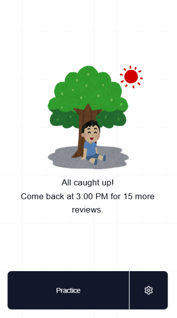

# WaniKani Mobile

This is a community-made mobile app for WaniKani. WaniKani is a Japanese language learning web app that uses mnemonics and SRS to make kanji learning simple.

This app is built using SvelteKit and optimized for performance, using optimistic rendering, async operations, and local data storage to give users a smooth experience.



## Try it out 🚀

I'm hosting the app [here on Vercel](https://svelte-wanikani-mobile.vercel.app).

## Local development

This project contains a [devcontainer configuration](.devcontainer/devcontainer.json), making it easy to start developing. All that's needed is to include the necessary environment variables.

### Environment variables

I use the Vercel CLI to link the application with my project in Vercel ([Read more](https://vercel.com/docs/cli)).

```bash
npx vercel link
```

After linking the project, create an `.env.local` file by running:

```bash
npx vercel env pull
```

These required variables should now be present.

```
CRON_SECRET=
PRIVATE_VAPID=
PUBLIC_VAPID=
CONTACT_EMAIL=
DATABASE_URL=
```

## Push notifications

An hourly cron job can be configured to trigger `/api/push-notifications` with
the header `x-cron-secret` (matching the environment variable `CRON_SECRET`).
This will notify any clients with pending reviews.

You can schedule the cron job by adding the following, using `crontab -e`.

```
0 * * * * curl --silent --show-error --fail --max-time 20 -H "x-cron-secret: SECRET" "https://HOST/api/push-notifications" > /dev/null 2>&1
```
